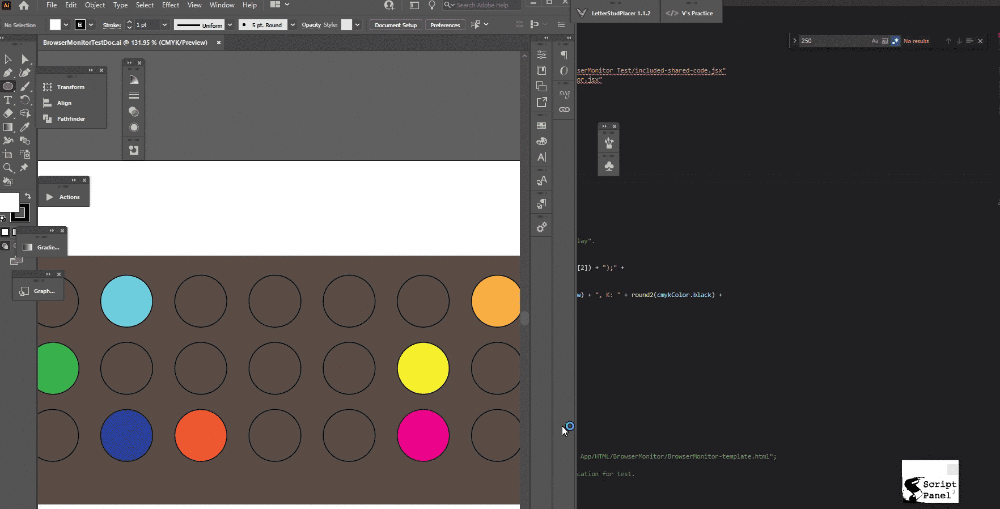

# HTML Template
The folder _HTML Template_ contains the files _BrowserMonitor-template.html_ and _BrowserMonitor-template.js_. These are non-minified files that one can modify and practice with by opening the HTML file in the browser and saving some different text to the JS file. A custom version can be made and referenced in the JSX script via an argument to the `BrowserMonitor` [constructor](Documentation.md#BrowserMonitor-Constructor-Arguments).

# BrowserMonitorTest
This example shows the usage of the `BrowserMonitor` in the context of iterating over numerous shapes in Illustrator and applying a random CMYK color to them under certain conditions.

## Test Documents
The folder _Test Documents_ contains these files:

* 
	_BrowserMonitorTestDoc-1<area>.ai_ - This file contains no items which are detected by the JSX script _BrowserMonitorTest.jsx_ as any kind of an error.

* _BrowserMonitorTestDoc-1-normal-errors<area>.ai_ - This file contains several items which are named 'BAD' in the layers panel. When the JSX script encounters such an item, it will add an error message to the progress monitor.

* _BrowserMonitorTestDoc-1-with-fatal-error<area>.ai_ - This file contains a shape called "REALLY BAD" in the layers panel. When the JSX script detects this name and adds a fatal error to the progress monitor as well as throwing the error to stop the JSX execution.

## Instructions
Open one of the test .ai files and run the script _BrowserMonitorTest.jsx_. The first time this is ran, a system dialog may pop up asking if you wish to open the HTML file in a browser. If this happens, click on the browser of your choice and ensure the "Always open with" checkbox is checked so this does not occur again. Additionally if this was the case, chances are that the JSX script has written multiple messages to the progress monitor while the system box was up - this would cause unexpected indications in the web page when it does come up. If this box is dismissed for all-time, this situation won't happen again.

[➡ Go to Documentation](Documentation.md)

[➡ Go to Overview](Overview.md)

[⬅ Back to README](README.md)
