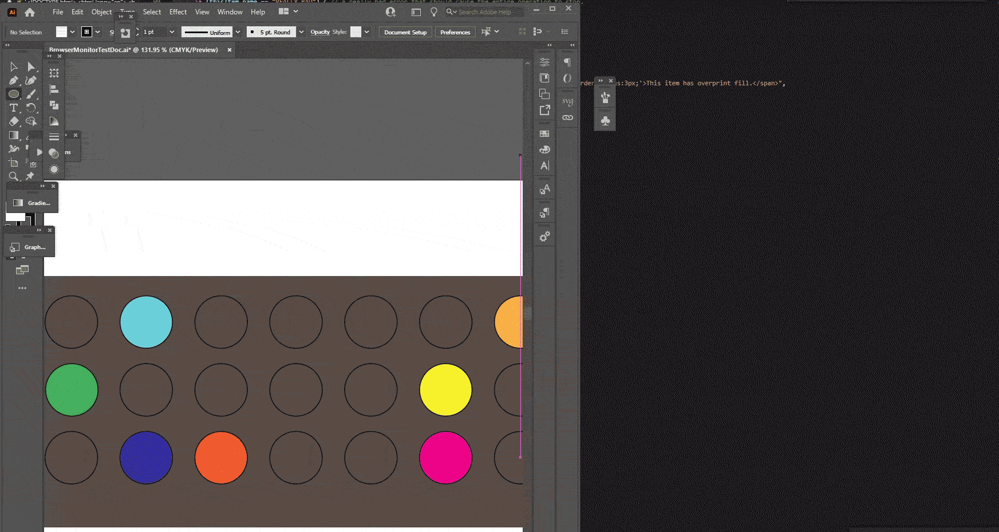

# BrowserMonitor
## An Adobe ExtendScript Batch-processing Progress Utility

This ExtendScript project writes and opens an HTML file which repeatedly queries a pre-determined JavaScript file which in turn is repeatedly written-to by an ongoing ExtendScript routine.

### Why?
Adobe JSX (ExtendScript) provides a ScriptUI api which is capable of creating progress bars and custom UI which theoretically are enough to meet most automation interface needs. However, they are unreliable and can possess nuances regarding cross-application and cross-platform operations which may impact development goals and times. A case-in-point is Illustrator's lack of checkable list items in a listbox (up to date of this writing in May, 2021 going years back to when it used to work) whereas other apps don't have the same problem.

While CEP extensions solve a lot of those UI-related issues, they are more intensive work-wise and ultimately succumb to the same portability issues: which applications support a subset of what events, what strange show-stopping bug is going to come up when we try to expand our extension to Photoshop, and what are some advantageous features we began to rely on as the core of our extension that we'll find are not supported in the other apps?

The main need for this technique however is the unresponsiveness of Adobe apps which are tasked with doing a lengthy consecutive series of operations known as a 'batch process'. Anything but a quick routine will send all or most Adobe applications into a state of lock-down, the kind where the screen goes white and all or most of their panels disappear from view. A ScriptUI progress bar would also disappear same as the other palettes, rendering them useless to users who wish to view a progress bar UI in order to gain an understanding of what their program is actually doing at a given time.

### Batch Processing
While it would be convenient to base a batch process off an existing single-process which has been ran and tested for reliability for years, more often than not it is the case of needing to create both for some new automation mission at the same time. Even if an single process existed, converting it to a batch process and doing such in general entails a whole different dimension in a workflow. Batch processing, by definition, requires less intervention and reduces human decision-making. It consolidates what otherwise would be 10 manual interactions to just 1.

It would be unwise to sit back and consider all being well when the power of inputs has been scaled such that one wrong decision could effect the quality of many orders more in the output.

Consider the following statements:

* 
	**Myth**: "We have this new awesome batch script! Time to expand our empire. Send the sales people to remote regions of the world to gather diverse orders for items which we aren't used to processing yet, the script does it all!"
	
	**Fact**: Once a scalable process is achieved, the temptation is to throw much more diverse inputs into it, which increases a chance of unhandled errors.

* 
	**Myth**: "With this new batch script, my work is easy-peasy. Matter of fact, I'll do this other thing before even taking a look at what I need to do today using this script. Surely there won't be a huge problem when I just hit the 'run' button at 4:59 pm!"

	**Fact**: Workers who have been empowered to scale up their work with a batch process, or their supervisors, may aggressively consume the savings their automation provides and fill the workday with other tasks which leaves less time to accurately activate the batch process. Are they treating the task with the same level of care as when performing the process manually for just 1 item when they are automatically doing 100 items?

* 
	**Myth**: "Ok, so there were a couple of problems with just certain files.. but that's not a worry, I can just re-run the problem items. Better remember to hit that 'run' button at 4:55 pm."

	**Fact**: Handled errors and other conveniences only exacerbate the user's consumption of the savings. Often, people will simply re-run a process after making some tweaks where needed; this is fine, but without proper monitoring this practice will delay important high-level findings regarding the causes of the issues. Additionally, users may get a sense of complacency and create urgent situations on the chance that a new batch is different from the others where its errors are too numerous to fix within the allotted amount of time.

* 
	**Myth**: "We have had this one-item script running perfectly for years now! When we make it a batch process, it will do everything perfectly x1000!"

	**Fact**: Even an established, reliable process can yield unexpected results when scaled up to become a batch process. Besides a potential for more diverse inputs, other factos may be at play that administrators are not aware of. For example, every time the 'reliable' single process is ran, a worker may actually be performing pre and post-processing tasks to ensure it is in fact reliable - now that it has been scaled up, they are unable to do so.

Basically, it becomes imperative to take measures to gain back as much insight into the process steps so as to maintain a healthy and efficient batch process. To that end, this very progress utility is designed to get near-real-time updates in a cross-application and a cross-platform way while still using the minimal JSX-only automation approach.

[Continue to Documentation 📚](Documentation.md)

[➡ Go to Code Example](Code%20Example.md)

[➡ Go to Overview](Overview.md)